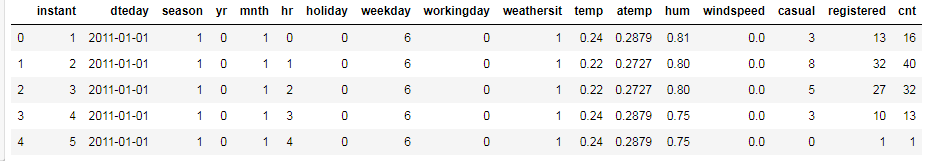

# Dillinger

I have implemented a classic neural network to predict on a dataset which is named [Bike Sharing Dataset](https://archive.ics.uci.edu/ml/datasets/Bike+Sharing+Dataset). This dataset consist of some riders from 1 Jan 2011 to 31 Dec 2102. You can see the content head of this dataset here.

The below image indicates the number of riders for the first ten days. Also, there are other data such as humidity, temperature, wind speed, etc. It seems all of these data impacts on the number of riders.

I have implemented a traditional network with 16 hidden layers. The learning rate of this network is set to one, and the number of iterations is set to 4000. I got 0.07 for training loss and 0.16 for validation loss as a result. Finally, I have tested, my model, on a data test that you can see the result in the below image.

